---
## Front matter
lang: ru-RU
title: Лабораторная работа №2
subtitle: Операционные системы
author:
  - Зарицкая М.П.
institute:
  - Российский университет дружбы народов, Москва, Россия
date: 18 февраля 2024

## i18n babel
babel-lang: russian
babel-otherlangs: english

## Formatting pdf
toc: false
toc-title: Содержание
slide_level: 2
aspectratio: 169
section-titles: true
theme: metropolis
header-includes:
 - \metroset{progressbar=frametitle,sectionpage=progressbar,numbering=fraction}
 - '\makeatletter'
 - '\beamer@ignorenonframefalse'
 - '\makeatother'
---

## Цель работы

Цель данной лабораторной работы -- изучение идеологии и применения средств контроля версий, освоение умения по работе с git.

## Задание

1. Создать базовую конфигурацию для работы с git
2. Создать ключ SSH
3. Создать ключ GPG
4. Настроить подписи Git
5. Заргеистрироваться на GitHub
6. Создать локальный каталог для выполнения заданий по предмету.

## Выполнение лабораторной работы. Установка ПО.

Устанавливаю необходимое программное обеспечение git и gh (рис. 1).

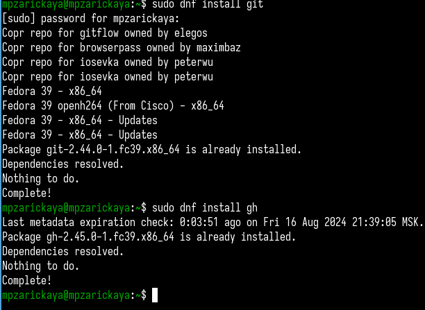{#fig:001 width=70%}

## Выполнение лабораторной работы. Базовая настройка git

Задаю в качестве имени и email владельца репозитория свои имя, фамилию и электронную почту (рис. 2).

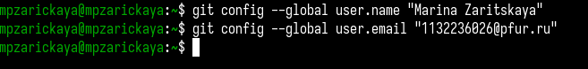{#fig:002 width=70%}

## Выполнение лабораторной работы. Базовая настройка git

Настраиваю utf-8 в выводе сообщений git для их корректного отображения (рис. 3).

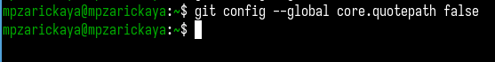{#fig:003 width=70%}

## Выполнение лабораторной работы. Базовая настройка git

Начальной ветке задаю имя master (рис. 4).

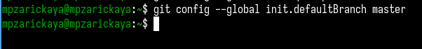{#fig:004 width=70%}

## Выполнение лабораторной работы. Базовая настройка git

Задаю параметры autocrlf и safecrlf (рис. 5).

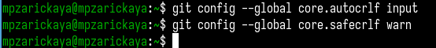{#fig:005 width=70%}

## Выполнение лабораторной работы. Создание ключа SSH

Создаю ключ ssh размером 4096 бит по алгоритму rsa (рис. 6).

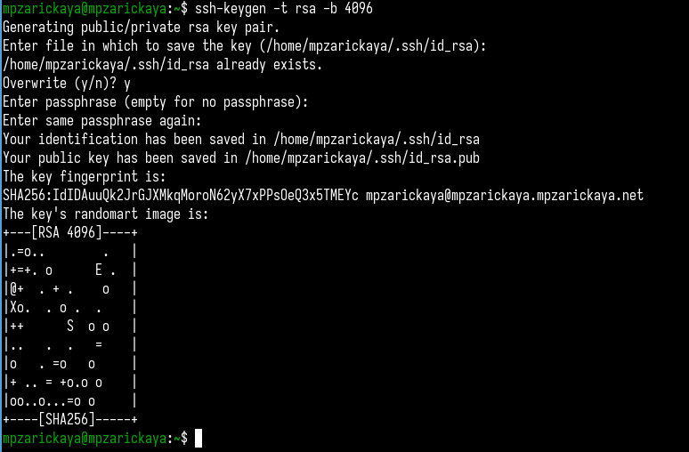{#fig:006 width=70%}

## Выполнение лабораторной работы. Создание ключа SSH

Создаю ключ ssh по алгоритму ed25519 (рис. 7).

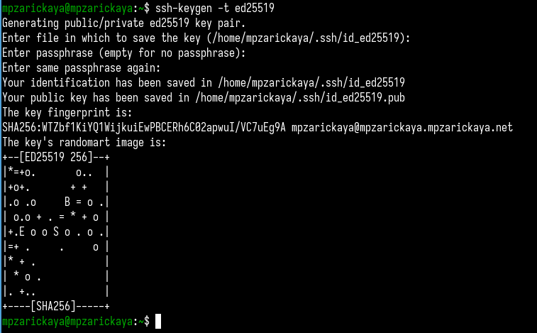{#fig:007 width=70%}

## Выполнение лабораторной работы. Создание ключа GPG

Генерирую ключ GPG, затем выбираю тип ключа RSA and RSA, задаю максиммальную длину ключа: 4096, оставляю неограниченный срок действия ключа. Далее отвечаю на вопросы программы о личной информации (рис. 8).

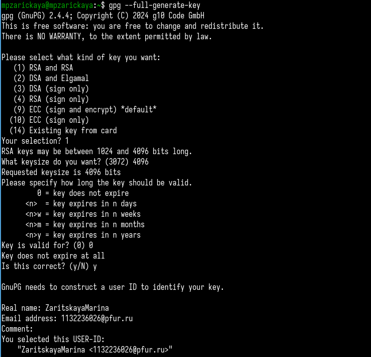{#fig:008 width=70%}

## Выполнение лабораторной работы. Регистрация на Github

Мой аккаунт на GitHub (рис. 9).

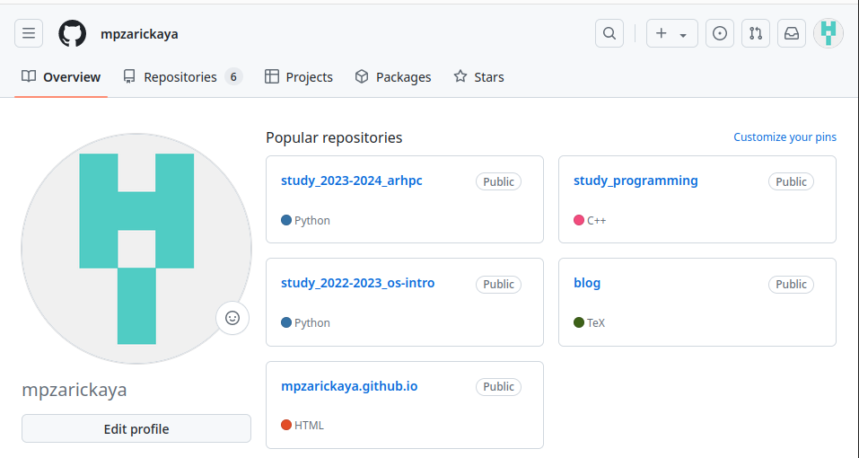{#fig:009 width=70%}

## Выполнение лабораторной работы. Добавление ключа GPG в Github

- Вывожу список созданных ключей в терминал
- Ищу в результате запроса отпечаток ключа
- Копирую его в буфер обмена (рис. 10).

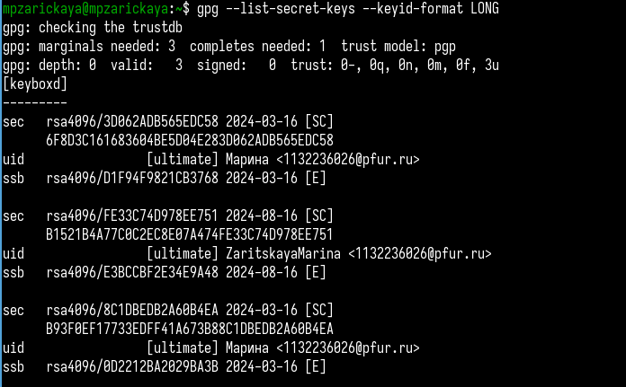{#fig:010 width=70%}

## Выполнение лабораторной работы. Добавление ключа GPG в Github

Ввожу в терминале команду, с помощью которой копирую сам ключ GPG в буфер обмена (рис. 12).

{#fig:011 width=70%}

## Выполнение лабораторной работы. Добавление ключа GPG в Github

- Открываю настройки GirHub, ищу среди них добавление GPG ключа.
- Нажимаю на "New GPG key" и вставляю в поле ключ из буфера обмена (рис. 12).
- Я добавила ключ GPG на GitHub.

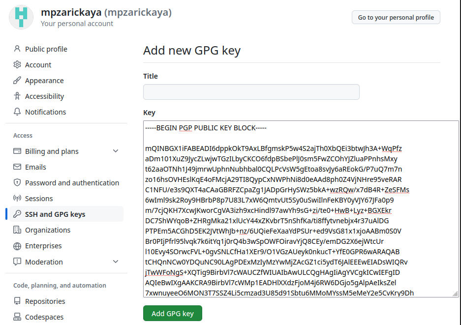{#fig:012 width=70%}

## Выполнение лабораторной работы. Настроить подписи Git

Настраиваю автоматические подписи коммитов git (рис. 13).

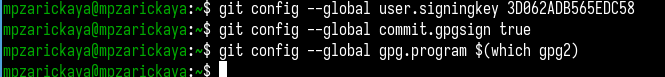{#fig:013 width=70%}

## Выполнение лабораторной работы. Настройка gh

- Начинаю авторизацию в gh
- отвечаю на наводящие вопросы от утилиты
- выбираю авторизоваться через браузер (рис. 14).

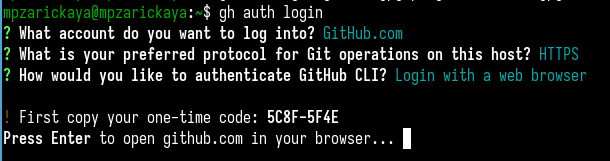{#fig:014 width=70%}

## Выполнение лабораторной работы. Настройка gh

Вижу сообщение о завершении авторизации под именем mpzarickaya (рис. 15).

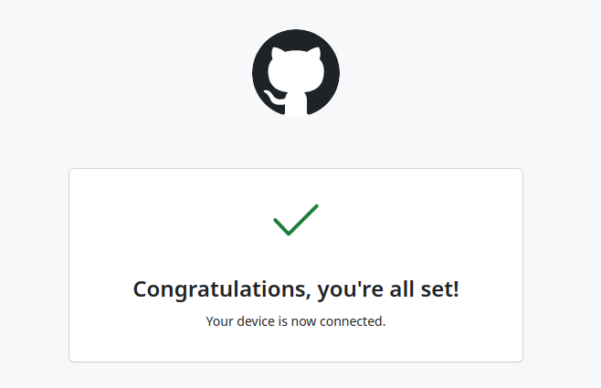{#fig:015 width=70%}

## Выводы

При выполнении данной лабораторной работы я изучила идеологию и применение средств контроля версий, освоила умение по работе с git.

## Список литературы{.unnumbered}

::: {#refs}
1. Лабораторная работа № 2 [Электронный ресурс] URL: https://esystem.rudn.ru/mod/page/view.php?id=970819
:::
