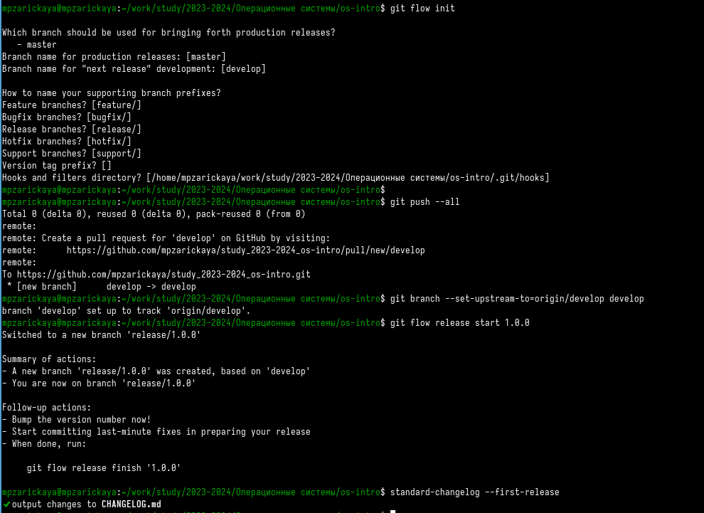

---
## Front matter
lang: ru-RU
title: Лабораторная работа №4
subtitle: Операционные системы
author:
  - Зарицкая М.П.
institute:
  - Российский университет дружбы народов, Москва, Россия
  
date: 5 марта 2024

## i18n babel
babel-lang: russian
babel-otherlangs: english

## Formatting pdf
toc: false
toc-title: Содержание
slide_level: 2
aspectratio: 169
section-titles: true
theme: metropolis
header-includes:
 - \metroset{progressbar=frametitle,sectionpage=progressbar,numbering=fraction}
 - '\makeatletter'
 - '\beamer@ignorenonframefalse'
 - '\makeatother'
---

## Докладчик

:::::::::::::: {.columns align=center}
::: {.column width="70%"}

  * Зарицкая Марина Петровна, НКАбд-01-23
  * Студентка факультета физико-математических и естественных наук
  * Российский университет дружбы народов
  * [1132236026@rudn.ru](mailto:1132236026@rudn.ru)

:::
::: {.column width="30%"}

:::
::::::::::::::

# Цель работы

Получение навыков правильной работы с репозиториями git. 

# Задание

1. Выполнить работу для тестового репозитория. 
2. Преобразовать рабочий репозиторий в репозиторий с git-flow и conventional commits. 

# Выполнение лабораторной работы

## Установка git-flow

Установка git flow из коллекции репозиториев Copr.
  

## Установка Node.js

Установила nodejs и pnpm.

## Настройка Node.js

Для работы с Node.js добавила каталог с исполняемыми файлами, устанавливаемыми yarn, в переменную PATH. Запустила необходимую команду и перелогинилась.

## Общепринятые коммиты

Запустила программы, которые используются для помощи в форматировании коммитов и в создании логов.

Создала репозиторий, сделала первый коммит и загрузила на гитхаб. Далее заполняю параметры пакета.

Добавила новые файлы, выполнила коммит, отправила на гитхаб.

Инициализировала git-flow. Префикс для ярлыков установила v. Проверила, что я на ветке develop. Загрузила весь репозиторий в хранилище. Установила внешнюю ветку как вышестоящую для этой ветки. Создала релиз с версией 1.0.0. Создала журнал изменений.

Создала ветку для новой функциональности. По окончании разработки новой функциональности следующим шагом следует объединить ветку. 
Создала релиз с версией 1.2.3. Обновила номер версии в файле package.json. Установила её в 1.2.3. Создала журнал изменений. Добавим журнал изменений в индекс. Залила релизную ветку в основную ветку. Отправила данные на github. Создала релиз на github с комментарием из журнала изменений.

# Выводы

 Получила навыки правильной работы с репозиториями git. 
