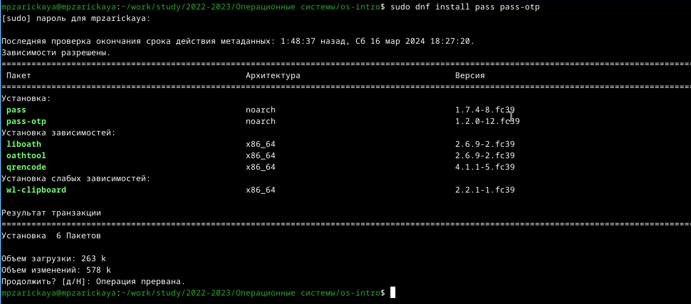
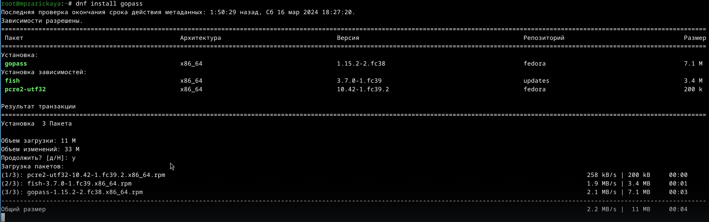
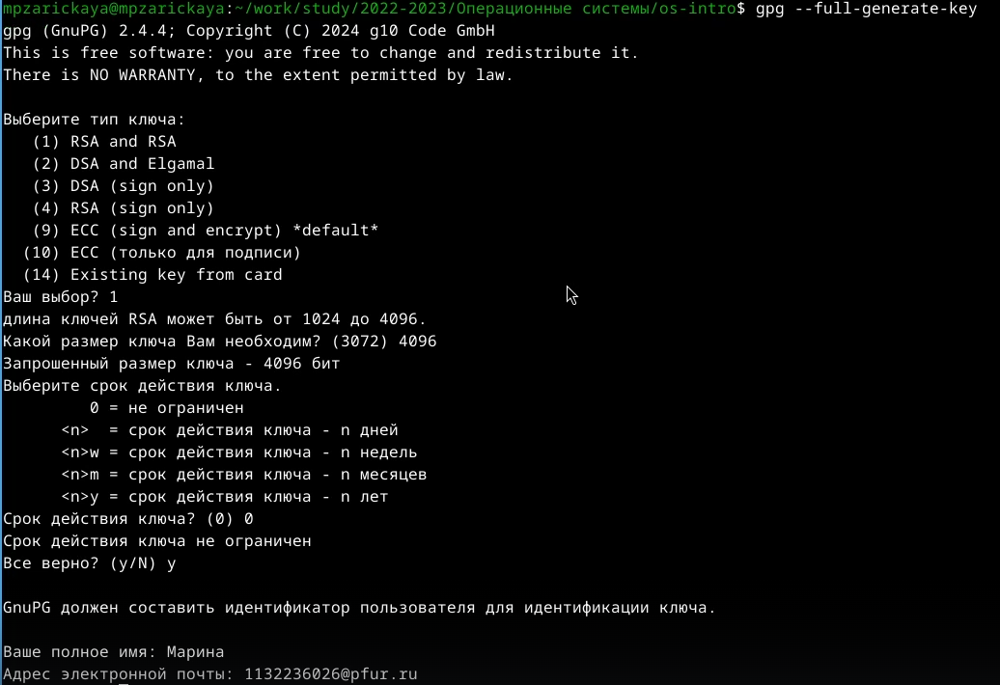
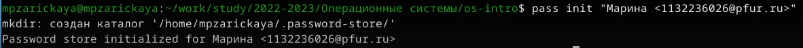
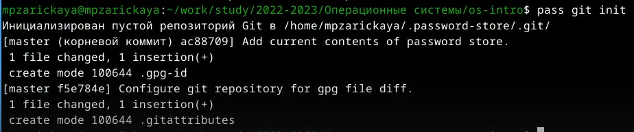
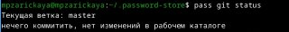
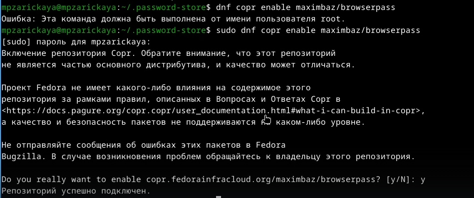
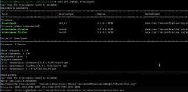

---
## Front matter
lang: ru-RU
title: Лабораторная работа №5
subtitle: Операционные системы
author:
  - Зарицкая М.П.
institute:
  - Российский университет дружбы народов, Москва, Россия
  
date: 5 марта 2024

## i18n babel
babel-lang: russian
babel-otherlangs: english

## Formatting pdf
toc: false
toc-title: Содержание
slide_level: 2
aspectratio: 169
section-titles: true
theme: metropolis
header-includes:
 - \metroset{progressbar=frametitle,sectionpage=progressbar,numbering=fraction}
 - '\makeatletter'
 - '\beamer@ignorenonframefalse'
 - '\makeatother'
---

## Докладчик

:::::::::::::: {.columns align=center}
::: {.column width="70%"}

  * Зарицкая Марина Петровна, НКАбд-01-23
  * Студентка факультета физико-математических и естественных наук
  * Российский университет дружбы народов
  * [1132236026@rudn.ru](mailto:1132236026@rudn.ru)

:::
::: {.column width="30%"}

:::
::::::::::::::

# Цель работы

Цель данной лабораторной работы -- настройка рабочей среды.

# Задание

1. Установка менеджера паролей pass
2. Настройка менеджера паролей
3. Настройка интерфейса с браузером

# Выполнение лабораторной работы

## Установка менеджера паролей pass

Устанавливаю менеджер паролей pass через терминал с помощью команд: dnf install pass pass-otp (рис. @fig:001).

{#fig:001 width=70%}

Устанавливаю gopass с помощью команды dnf install gopass (рис. @fig:002).

{#fig:002 width=70%}

## Настройка менеджера паролей

Создаю ключ GPG через gpg --full-generate-key(рис. @fig:003).

{#fig:003 width=70%}

Инициализирую хранилище (pass init) (рис. @fig:004).

{#fig:004 width=70%}

Создаю структуру git: pass git init (рис. @fig:005).
Для синхронизации выполняется следующая команда:

pass git pull
pass git push
Прямые изменения: Следует заметить, что отслеживаются только изменения, сделанные через сам gopass (или pass).
Если изменения сделаны непосредственно на файловой системе, необходимо вручную закоммитить и выложить изменения:

cd ~/.password-store/
git add .
git commit -am 'edit manually'
git push 

{#fig:005 width=70%}

Проверить статус синхронизации можно командой: pass git status (рис. @fig:006).

{#fig:006 width=70%}

## Настройка интерфейса с браузером

Для взаимодействия с броузером используется интерфейс native messaging. Поэтому кроме плагина к броузеру устанавливается программа, обеспечивающая интерфейс native messaging. (рис. @fig:007).

{#fig:006 width=70%}

Устанавливаю browserpass (dnf install browserpass)

{#fig:008 width=70%}

# Выводы

При выполнении данной лабораторной работы я установила менеджер паролей pass и настроила рабочую среду.

