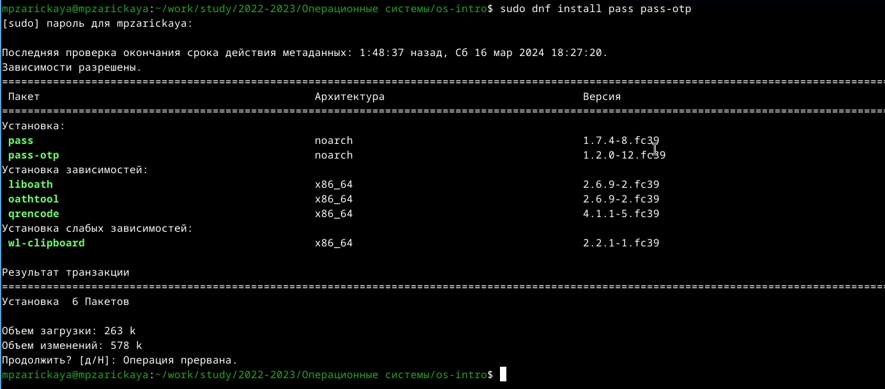
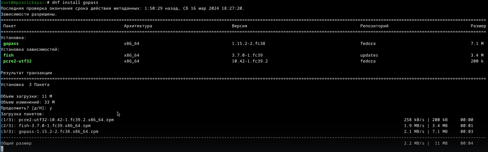
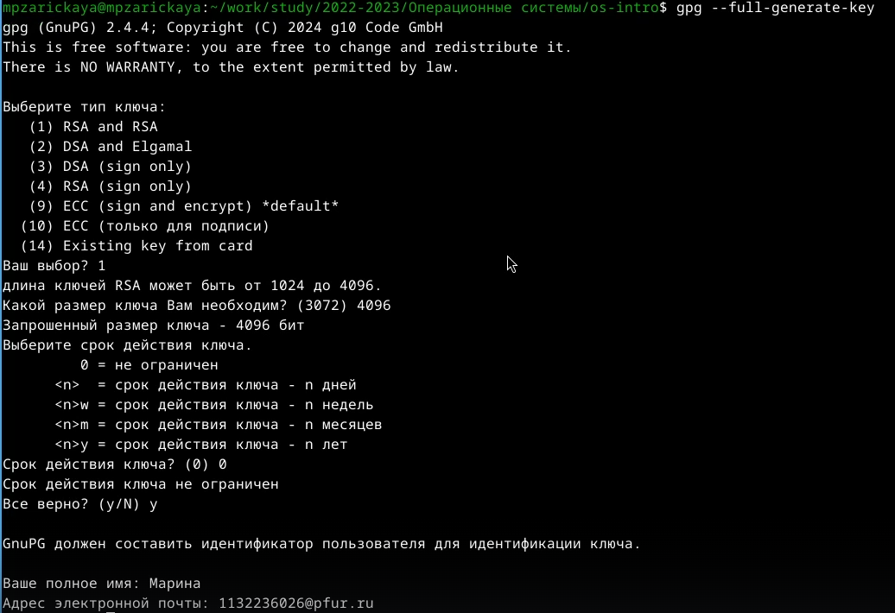
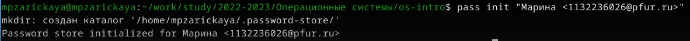
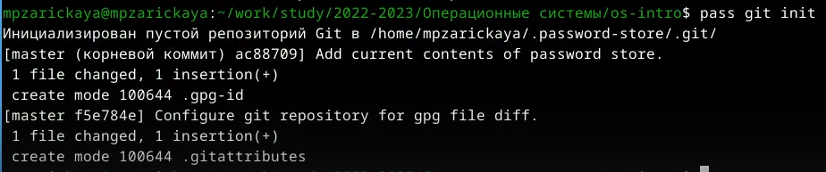
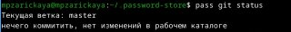
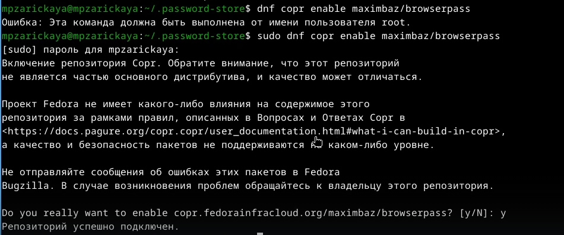
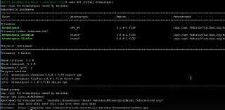

---
## Front matter
title: "Отчет по лабораторной работе №5"
subtitle: "Операционные системы"
author: "Зарицкая Марина Петровна"

## Generic otions
lang: ru-RU
toc-title: "Содержание"

## Bibliography
bibliography: bib/cite.bib
csl: pandoc/csl/gost-r-7-0-5-2008-numeric.csl

## Pdf output format
toc: true # Table of contents
toc-depth: 2
lof: true # List of figures
lot: true # List of tables
fontsize: 12pt
linestretch: 1.5
papersize: a4
documentclass: scrreprt
## I18n polyglossia
polyglossia-lang:
  name: russian
  options:
	- spelling=modern
	- babelshorthands=true
polyglossia-otherlangs:
  name: english
## I18n babel
babel-lang: russian
babel-otherlangs: english
## Fonts
mainfont: PT Serif
romanfont: PT Serif
sansfont: PT Sans
monofont: PT Mono
mainfontoptions: Ligatures=TeX
romanfontoptions: Ligatures=TeX
sansfontoptions: Ligatures=TeX,Scale=MatchLowercase
monofontoptions: Scale=MatchLowercase,Scale=0.9
## Biblatex
biblatex: true
biblio-style: "gost-numeric"
biblatexoptions:
  - parentracker=true
  - backend=biber
  - hyperref=auto
  - language=auto
  - autolang=other*
  - citestyle=gost-numeric
## Pandoc-crossref LaTeX customization
figureTitle: "Рис."
tableTitle: "Таблица"
listingTitle: "Листинг"
lofTitle: "Список иллюстраций"
lotTitle: "Список таблиц"
lolTitle: "Листинги"
## Misc options
indent: true
header-includes:
  - \usepackage{indentfirst}
  - \usepackage{float} # keep figures where there are in the text
  - \floatplacement{figure}{H} # keep figures where there are in the text
---

# Цель работы

Цель данной лабораторной работы -- настройка рабочей среды.

# Задание

1. Установка менеджера паролей pass
2. Настройка менеджера паролей
3. Настройка интерфейса с браузером

# Выполнение лабораторной работы

## Установка менеджера паролей pass

Устанавливаю менеджер паролей pass через терминал с помощью команд: dnf install pass pass-otp (рис. @fig:001).

{#fig:001 width=70%}

Устанавливаю gopass с помощью команды dnf install gopass (рис. @fig:002).

{#fig:002 width=70%}

## Настройка менеджера паролей

Создаю ключ GPG через gpg --full-generate-key(рис. @fig:003).

{#fig:003 width=70%}

Инициализирую хранилище (pass init) (рис. @fig:004).

{#fig:004 width=70%}

Создаю структуру git: pass git init (рис. @fig:005).
Для синхронизации выполняется следующая команда:

pass git pull
pass git push
Прямые изменения: Следует заметить, что отслеживаются только изменения, сделанные через сам gopass (или pass).
Если изменения сделаны непосредственно на файловой системе, необходимо вручную закоммитить и выложить изменения:

cd ~/.password-store/
git add .
git commit -am 'edit manually'
git push 

{#fig:005 width=70%}

Проверить статус синхронизации можно командой: pass git status (рис. @fig:006).

{#fig:006 width=70%}

## Настройка интерфейса с браузером

Для взаимодействия с броузером используется интерфейс native messaging. Поэтому кроме плагина к броузеру устанавливается программа, обеспечивающая интерфейс native messaging. (рис. @fig:007).

{#fig:006 width=70%}

Устанавливаю browserpass (dnf install browserpass)

{#fig:008 width=70%}

# Выводы

При выполнении данной лабораторной работы я установила менеджер паролей pass и настроила рабочую среду.

